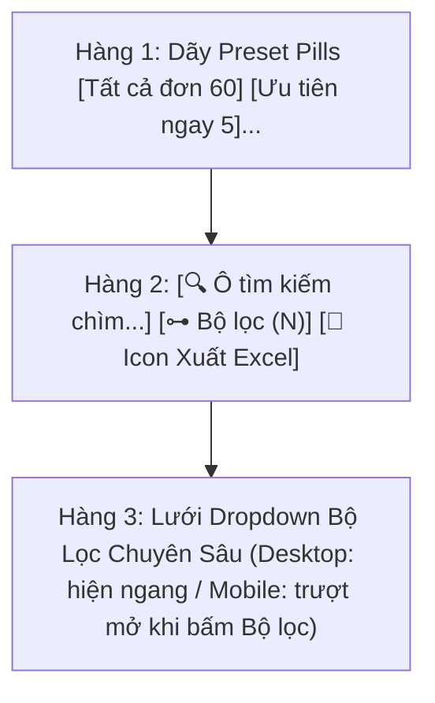

# 🍏 Apple Glass Design System — thegioitrimun.vn
> **Bộ quy chuẩn thiết kế giao diện Kính Mờ (Glassmorphism / Apple Glass)** áp dụng đồng bộ trên toàn bộ hệ sinh thái website (Client Storefront & Admin Workspace).

---

## 1. Triết lý Thiết kế Cốt lõi (Core Design Philosophy)

Ngôn ngữ thiết kế **Apple Glass** trên *thegioitrimun.vn* lấy cảm hứng từ sự tinh tế của iOS, macOS và visionOS, hướng đến trải nghiệm người dùng cao cấp, siêu mượt và tối giản:

1. **Trong trẻo & Nhẹ nhàng (Translucent & Lightweight)**: Người dùng cảm nhận rõ chiều sâu không gian đa lớp với hiệu ứng mờ bán trong suốt (`backdrop-blur-xl`), không bị cảm giác các khối hộp đặc quánh che khuất nội dung.
2. **Viền Kính Phản Quang (Specular Borders)**: Dùng viền bán trong suốt siêu mảnh (`border-white/70 dark:border-white/10`) để các khối thẻ tự tách lớp thanh lịch dưới ánh sáng, không cần viền đen nặng nề.
3. **Tối Giản Chiều Dọc & Tận Dụng Màn Hình (Vertical Economy & Edge-to-Edge)**: Mọi pixel trên di động đều quý giá. Loại bỏ mọi dòng tiêu đề tĩnh, badge lặp lại hay khoảng đệm lồng ghép thừa thãi. Danh sách dữ liệu phải hiện lên cao nhất có thể.
4. **Không Gây Ức Chế Thị Giác (Zero Visual Blockage)**: Menu thao tác nhanh, popover tuyệt đối không dùng màn phủ đen hoặc blur toàn trang làm người dùng tưởng ứng dụng bị đơ/lỗi.

---

## 2. Quy chuẩn Thanh Điều Hướng Nhanh Trên Mobile (Task Tabs Bar)

Thanh chuyển tab các module chức năng chính (như *Tổng quan / Đơn hàng / Khách hàng / Lịch hẹn...*):

> [!IMPORTANT]
> **QUY TẮC BẮT BUỘC**:
> - Khung bọc ngoài tab di động phải để **hoàn toàn trong suốt** (`bg-transparent border-0 p-0`), **KHÔNG ĐƯỢC** bọc trong thẻ xám dày có viền (`rounded-2xl border bg-background/85`).
> - Các nút viên thuốc được trượt ngang tự nhiên và liền mạch trên nền trang.

```tsx
{/* Thanh tab mobile: Trong suốt, lướt ngang mượt mà */}
<div className="lg:hidden bg-transparent border-0 p-0">
    <div className="flex snap-x overflow-x-auto hide-scrollbar gap-1.5 pb-0.5 scrollbar-none [scrollbar-width:none] [&::-webkit-scrollbar]:hidden">
        {tabs.map((tab) => (
            <button
                key={tab.id}
                type="button"
                onClick={() => setActiveTab(tab.id)}
                className={`shrink-0 snap-start rounded-full border px-4 py-2 text-sm font-semibold transition-all active:scale-95 ${
                    activeTab === tab.id
                        ? 'border-primary bg-primary text-primary-foreground shadow-sm'
                        : 'border-border/50 bg-card text-muted-foreground hover:bg-muted hover:text-foreground'
                }`}
            >
                {tab.label}
            </button>
        ))}
    </div>
</div>
```

---

## 3. Quy chuẩn Thẻ Header & Bộ Lọc Thống Nhất (Unified Filter Card)

Áp dụng đồng bộ cho các trang quản trị chính: **Đơn hàng**, **Khách hàng**, **Lịch hẹn**, **Sản phẩm**.

### 3.1. Nguyên tắc Bố cục Siêu Tinh Gọn (Zero Overhead Layout)
- **Không đặt dòng tiêu đề thừa phía trên**: Loại bỏ hoàn toàn các dòng `Danh sách đơn [60 đơn]` hay `Danh sách khách [28 khách]` phía trên. Thẻ bộ lọc bắt đầu ngay bằng hàng viên thuốc hoặc ô tìm kiếm.
- **Tích hợp tất cả trong 1 thẻ kính mờ duy nhất**: Không tách thanh tìm kiếm lơ lửng bên ngoài.
- **Khoảng cách tràn viền chuẩn trên Mobile**: Wrapper container dùng `-mx-3 sm:mx-0` (Margin 0px -12px) để triệt tiêu padding 12px ngoài cùng của layout admin, các khối thẻ con dùng `mx-1 sm:mx-0` để giữ đúng 4px khoảng thở tinh tế với viền màn hình điện thoại.

### 3.2. Cấu trúc 3 Hàng Chuẩn (Standard 3-Row Layout):



### 3.3. Mã nguồn mẫu chuẩn (Standard Implementation):

```tsx
<div className="rounded-2xl sm:rounded-[1.7rem] border border-white/70 bg-card/75 shadow-[0_28px_70px_-48px_rgba(24,35,32,0.55)] backdrop-blur-2xl dark:border-white/10 p-3 sm:p-4 mx-1 sm:mx-0">
    
    {/* HÀNG 1: Dãy viên thuốc phân loại nhanh (Preset Pills Row) */}
    <div className="flex items-center gap-1.5 overflow-x-auto pb-1.5 scrollbar-none [scrollbar-width:none] [-ms-overflow-style:none] [&::-webkit-scrollbar]:hidden">
        {presets.map((preset) => {
            const isActive = currentPreset === preset.key;
            return (
                <button
                    key={preset.key}
                    type="button"
                    onClick={() => setPreset(preset.key)}
                    className={`inline-flex shrink-0 items-center gap-1.5 rounded-xl px-3 py-1.5 text-xs font-semibold transition-all active:scale-95 ${
                        isActive
                            ? 'bg-primary text-primary-foreground shadow-xs'
                            : 'border border-border/60 bg-background/40 text-muted-foreground hover:bg-muted hover:text-foreground'
                    }`}
                >
                    <span>{preset.label}</span>
                    {preset.count > 0 && (
                        <span className={`rounded-full px-1.5 py-0.2 text-[10px] font-bold ${
                            isActive ? 'bg-primary-foreground/20 text-primary-foreground' : 'bg-muted text-foreground'
                        }`}>
                            {preset.count}
                        </span>
                    )}
                </button>
            );
        })}
    </div>

    {/* HÀNG 2: Tìm kiếm + Nút Bộ lọc + Nút Xuất Excel icon-only */}
    <div className="mt-2 flex items-center gap-1.5 sm:gap-2">
        {/* Ô tìm kiếm kính mờ chìm đổ bóng trong */}
        <div className="relative flex-1">
            <input
                type="text"
                value={searchQuery}
                onChange={(e) => setSearchQuery(e.target.value)}
                placeholder="Tìm theo mã, tên, SĐT..."
                className="w-full h-9 rounded-xl border-0 bg-background/30 backdrop-blur-xl shadow-[inset_0_1px_3px_rgba(0,0,0,0.1),0_1px_0_rgba(255,255,255,0.1)] pl-8 pr-8 text-xs placeholder:text-muted-foreground/70 focus:ring-1 focus:ring-primary/50 outline-none transition-all"
            />
            <SearchIcon className="absolute left-2.5 top-2.5 w-4 h-4 text-muted-foreground" />
            {searchQuery && (
                <button
                    type="button"
                    onClick={() => setSearchQuery('')}
                    className="absolute right-2 top-2 p-0.5 rounded-full text-muted-foreground hover:text-foreground"
                >
                    <CloseIcon className="w-3.5 h-3.5" />
                </button>
            )}
        </div>

        {/* Nút bật/tắt bộ lọc chuyên sâu */}
        <button
            type="button"
            onClick={() => setShowFilters(!showFilters)}
            className={`flex items-center gap-1.5 h-9 px-3 rounded-xl border text-xs font-semibold transition-all shrink-0 active:scale-95 ${
                showFilters || activeFilterCount > 0
                    ? 'border-primary/50 bg-primary/10 text-primary font-bold shadow-xs'
                    : 'border-border/60 bg-background/40 text-muted-foreground hover:text-foreground hover:bg-muted/50'
            }`}
        >
            <FilterIcon className="w-3.5 h-3.5" />
            <span>Bộ lọc</span>
            {activeFilterCount > 0 && (
                <span className="flex h-4 min-w-[1rem] px-1 items-center justify-center rounded-full bg-primary text-primary-foreground text-[10px] font-bold">
                    {activeFilterCount}
                </span>
            )}
        </button>

        {/* Nút Xuất Excel: ICON-ONLY, dùng icon hệ thống */}
        <button
            type="button"
            onClick={handleExport}
            disabled={isExporting}
            className="flex h-9 w-9 items-center justify-center rounded-xl border border-border/60 bg-background/40 shadow-2xs backdrop-blur-md transition-all hover:bg-muted/50 active:scale-95 disabled:opacity-50 shrink-0"
            title="Xuất file Excel"
        >
            {isExporting ? (
                <Spinner className="w-4 h-4 text-primary" />
            ) : (
                
            )}
        </button>
    </div>

    {/* HÀNG 3: Lưới dropdown bộ lọc chuyên sâu */}
    <div className={`mt-2.5 grid grid-cols-2 gap-2 sm:grid-cols-2 lg:grid-cols-4 xl:grid-cols-5 transition-all ${
        showFilters ? 'grid' : 'hidden xl:grid'
    }`}>
        {/* Thanh thông tin và nút xóa bộ lọc (hiện khi có filter active) */}
        {activeFilterCount > 0 && (
            <div className="col-span-2 sm:col-span-2 lg:col-span-4 xl:col-span-5 flex items-center justify-between pb-1 border-b border-border/20">
                <span className="text-[11px] font-bold uppercase tracking-wider text-muted-foreground">
                    {filteredItems.length} kết quả tìm thấy
                </span>
                <button
                    type="button"
                    onClick={resetFilters}
                    className="text-[11px] font-semibold text-primary hover:underline"
                >
                    Xóa bộ lọc ({activeFilterCount})
                </button>
            </div>
        )}

        {/* Các cột select lọc */}
        <div>
            <label className="text-[10px] font-bold uppercase text-muted-foreground mb-1 block">Trạng thái</label>
            <select className="w-full h-8 rounded-lg border-0 bg-background/30 backdrop-blur-xl shadow-[inset_0_1px_3px_rgba(0,0,0,0.1)] px-2.5 text-xs outline-none focus:ring-1 focus:ring-primary/50">
                <option value="all">Tất cả</option>
            </select>
        </div>
        ...
    </div>
</div>
```

---

## 4. Quy tắc Xử lý Backdrop & Menu Popover 3 Chấm

> [!CAUTION]
> **LỖI PHỔ BIẾN CẦN TRÁNH TUYỆT ĐỐI**:
> - **KHÔNG** dùng backdrop đen tối màu (`bg-black/25`, `bg-black/50`) hoặc phủ `backdrop-blur` lên toàn màn hình khi mở menu 3 chấm.
> - **KHÔNG** dùng nền kính mờ xuyên thấu (`bg-card/95 backdrop-blur-2xl`) cho hộp popover vì sẽ để lộ các dòng chữ bên dưới, tạo cảm giác mờ nhòe bẩn mắt.

### ✅ Giải pháp Chuẩn Apple Glass:
```tsx
{/* 1. Nút kích hoạt 3 chấm */}
<div className="relative shrink-0" data-mobile-action-menu>
    <button
        type="button"
        onClick={() => setOpenMenuId(item.id)}
        className="flex h-7 w-7 items-center justify-center rounded-xl border border-border/70 bg-card/50 backdrop-blur-xl text-muted-foreground hover:bg-card/80 hover:text-foreground active:scale-95 transition-all"
    >
        <ThreeDotsIcon className="h-4 w-4" />
    </button>

    {/* 2. Menu Popover Dropdown khi mở */}
    {isOpen && (
        <>
            {/* Lớp bắt sự kiện chạm ngoài: HOÀN TOÀN VÔ HÌNH (100% trong suốt, KHÔNG blur, KHÔNG đổi màu) */}
            <div
                className="fixed inset-0 z-40 bg-transparent"
                onClick={() => setOpenMenuId(null)}
            />

            {/* Thẻ menu popover: Nền đục 100% (Solid bg-card giống Sidebar), bóng sâu shadow-2xl, viền border-border/80 */}
            <div
                className="absolute right-0 top-9 z-50 w-56 rounded-2xl border border-border/80 bg-card p-1.5 shadow-2xl transition-all animate-in fade-in zoom-in-95"
                onClick={(e) => e.stopPropagation()}
            >
                <div className="space-y-0.5">
                    <button
                        type="button"
                        onClick={handleAction}
                        className="flex w-full items-center gap-2.5 rounded-xl px-2.5 py-2 text-xs font-semibold text-foreground hover:bg-primary/10 hover:text-primary transition-colors"
                    >
                        <ActionIcon className="h-4 w-4 text-primary" />
                        <span>Xem chi tiết</span>
                    </button>
                    ...
                </div>
            </div>
        </>
    )}
</div>
```
- **Lớp click catcher**: `fixed inset-0 z-40 bg-transparent` giúp chạm bất kỳ đâu ngoài menu để đóng ngay lập tức, nền danh sách bên dưới **vẫn sáng rõ 100%, sắc nét và tự nhiên**.
- **Popover Dropdown**: Sử dụng `bg-card` hoàn toàn đục (solid 100%, đồng bộ với nền Sidebar) kết hợp `shadow-2xl` để menu nổi bật dứt khoát trên bề mặt thẻ bên dưới.

---

## 5. Quy chuẩn Trải Nghiệm Mobile Drill-Down (Chi Tiết Hồ Sơ)

Khi hiển thị danh sách có kèm màn hình chi tiết (như *Khách hàng*, *Chi tiết đơn*):

- **Trên Mobile (`< lg`)**:
  - Khi xem danh sách: Danh sách chiếm trọn màn hình, cuộn mượt mà.
  - Khi nhấn vào 1 mục: Tự động chuyển sang **Màn hình Chi tiết toàn diện (Drill-down)** kèm thanh điều hướng trên cùng có nút `← Quay lại danh sách`.
  - **Tuyệt đối không** xếp chồng chi tiết ở cuối trang khiến người dùng phải vuốt mỏi tay xuống đáy để tìm thông tin.
- **Trên Desktop (`≥ lg`)**:
  - Bố cục 2 cột đối xứng chuẩn Apple: Cột trái (Danh sách cuộn độc lập) và Cột phải (Hồ sơ chi tiết ghim cố định `sticky top-20`).

---

## 6. Bảng Tra cứu Tokens & Utility Classes Apple Glass

### 6.1. Nền kính mờ (Glass Backgrounds)
- **Thẻ Header & Filter thống nhất**: `bg-card/75 backdrop-blur-2xl border border-white/70 dark:border-white/10`
- **Thẻ danh sách / Card nội dung**: `bg-card/60 backdrop-blur-xl dark:bg-card/50 border border-border/70`
- **Popover / Menu 3 chấm / Dropdown**: `bg-card shadow-2xl border border-border/80` *(Đục 100%, không blur xuyên thấu)*
- **Ô tìm kiếm / Input kính chìm**: `bg-background/30 backdrop-blur-xl shadow-[inset_0_1px_3px_rgba(0,0,0,0.1),0_1px_0_rgba(255,255,255,0.1)]`
- **Nút bấm icon-only (Xuất Excel, Thao tác)**: `border border-border/60 bg-background/40 shadow-2xs backdrop-blur-md hover:bg-muted/50`

### 6.2. Icon hệ thống (System WebP Icons)
- **Nút Xuất Excel**:
  ```html
  https://thegioitrimun.vn/r2/assets/admin-icons/20260718102440-outputexcel.webp
  ```
  *(Dùng thẻ `` với `w-4.5 h-4.5 object-contain`, không dùng SVG tùy biến).*

### 6.3. Bo góc chuẩn (Border Radii)
- **Thẻ Header Card / Container lớn**: `rounded-2xl sm:rounded-[1.7rem]` hoặc `rounded-3xl`
- **Thẻ card đơn hàng / Khách hàng**: `rounded-2xl`
- **Nút bấm / Ô nhập liệu / Viên thuốc tab**: `rounded-xl`
- **Pill badge đếm số / Status Dot**: `rounded-full`

---

## 7. Bảng Tổng hợp: NÊN LÀM (DO) & KHÔNG NÊN LÀM (DON'T)

| Tiêu chí | 🟢 NÊN LÀM (DO) | 🔴 KHÔNG NÊN LÀM (DON'T) |
| :--- | :--- | :--- |
| **Tiêu đề Toolbar** | Loại bỏ tiêu đề thừa (`Danh sách đơn`, `Danh sách khách`), để danh sách đẩy lên cao nhất. | Đặt thẻ tiêu đề to + badge đếm số lượng chiếm 40-50px không gian quý giá. |
| **Nút Xuất Excel** | Dạng icon-only `h-9 w-9 rounded-xl`, dùng ảnh WebP hệ thống `outputexcel.webp`. | Dùng nút to có chữ `Xuất đơn` / `Xuất Excel` làm tràn hàng trên mobile. |
| **Tabs Di Động** | Nền trong suốt `bg-transparent border-0 p-0`, các tab trượt ngang nhẹ nhàng. | Bọc trong khung xám viền dày `bg-background/85 border p-1.5`. |
| **Khoảng đệm Mobile** | Container dùng `-mx-3 sm:mx-0` (Margin 0px -12px), thẻ con dùng `mx-1 sm:mx-0` (4px). | Dùng margin dương gây thụt sâu hoặc dính sát mép kính màn hình. |
| **Backdrop Popover** | Dùng `fixed inset-0 z-40 bg-transparent` (chạm ngoài tắt, nền sáng rõ). | Dùng `bg-black/25` hoặc `backdrop-blur` làm đen sầm cả trang. |
| **Nền Popover 3 chấm** | Dùng `bg-card` đục 100% (solid), `shadow-2xl` sắc nét, tách biệt lớp rõ ràng. | Dùng `bg-card/95 backdrop-blur-2xl` bị xuyên thấu chữ phía sau. |
| **Tương tác nút** | Thêm `active:scale-95` tạo cảm giác phản hồi xúc giác cơ học như iOS thật. | Nút bấm cứng đơ, không có phản hồi khi chạm. |
| **Duyệt chi tiết mobile** | Dùng Drill-Down (toàn màn hình có nút `← Quay lại danh sách`). | Bắt người dùng cuộn dài xuống đáy trang để đọc hồ sơ chi tiết. |
