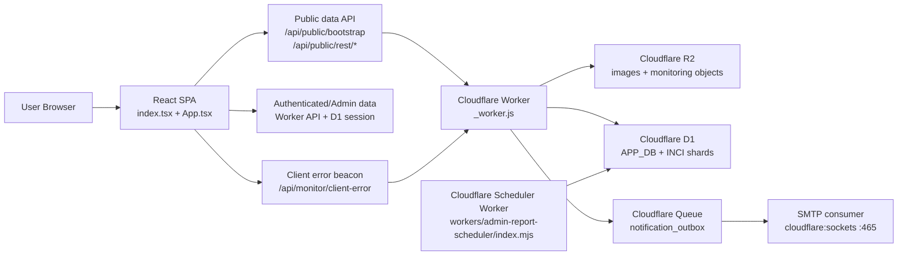

# Project Architecture

Tài liệu này mô tả kiến trúc thực tế của dự án tại thời điểm hiện tại, không phải kiến trúc lý tưởng.

## 1. Mục tiêu hệ thống

Đây là một web app cho phòng khám da liễu + nhà thuốc online, chạy theo mô hình:

- frontend React SPA
- edge layer trên Cloudflare Pages/Worker
- dữ liệu nghiệp vụ trong Cloudflare D1 (`APP_DB` và các shard `INCI_DB`)
- OAuth/session, email outbox, Queue và SMTP đều đi qua Cloudflare Worker
- media public đi qua Cloudflare R2

Hệ thống đang là một `modular monolith`:

- một SPA lớn điều phối hầu hết UI
- một file worker lớn làm edge gateway
- một service layer lớn làm data access + mapping
- D1 chứa dữ liệu production; Supabase chỉ còn là lịch sử migration/đối soát

Nói ngắn gọn: dự án chưa tách thành nhiều service độc lập, nhưng đã có các lớp trách nhiệm khá rõ.

## 2. Sơ đồ tổng thể



## 3. Thư mục quan trọng

### Frontend

- [index.tsx](./index.tsx)
- [App.tsx](./App.tsx)
- [components/](./components)
- [contexts/](./contexts)
- [hooks/](./hooks)
- [src/](./src)

### Data access

- [services/api.ts](./services/api.ts)
- [services/supabaseClient.d1.ts](./services/supabaseClient.d1.ts) (compatibility shim fail-closed cho D1 build)
- [services/runtimeLoaders.ts](./services/runtimeLoaders.ts)

### Edge/runtime

- [_worker.js](./_worker.js)
- [wrangler.jsonc](./wrangler.jsonc)
- [workers/admin-report-scheduler/index.mjs](./workers/admin-report-scheduler/index.mjs)

### Database và functions

- [supabase/config.toml](./supabase/config.toml)
- [supabase/migrations/](./supabase/migrations)
- [supabase/functions/](./supabase/functions)

### QA / vận hành

- [scripts/](./scripts)
- [e2e/](./e2e)

## 4. Frontend architecture

### 4.1 Boot sequence

Entry point là [index.tsx](./index.tsx):

- khởi tạo i18n và CSS global
- mount React root
- bọc app bằng các provider:
  - `ThemeProvider`
  - `FontProvider`
  - `ToastProvider`
  - `CartProvider`
  - `WishlistProvider`

Điểm đáng chú ý:

- app không dùng Redux/Zustand
- phần state toàn cục chủ yếu nằm ở React Context và state tập trung trong `App.tsx`

### 4.2 App.tsx là composition root

[App.tsx](./App.tsx) là trung tâm điều phối của toàn bộ SPA:

- giữ `view state`
- đồng bộ `view <-> URL`
- tải bootstrap data
- quản lý auth hydration
- dựng SEO meta + JSON-LD
- điều phối navigation giữa public pages, account pages, admin pages

Điều này có hai hệ quả:

- lợi ích: rất dễ theo dõi toàn bộ flow tại một chỗ
- bất lợi: `App.tsx` đang lớn và là điểm coupling mạnh nhất của frontend

### 4.3 Router hiện tại là custom router, không dùng React Router

App không dùng `react-router`. Thay vào đó, [App.tsx](./App.tsx) tự làm router bằng:

- `View` type trong [types.ts](./types.ts)
- `pathToView()`
- `viewToPath()`
- `window.history.pushState/replaceState`

Ý nghĩa kiến trúc:

- route model được kiểm soát hoàn toàn bằng TypeScript union
- không có nested route tree kiểu framework
- các page được render bằng `switch(view.page)`

### 4.4 Lazy loading và deferred runtime loading

Frontend dùng 2 cấp tối ưu tải:

1. `React.lazy()` cho các page/component lớn
2. proxy deferred cho `services/api.ts` và compatibility module trong [services/runtimeLoaders.ts](./services/runtimeLoaders.ts)

Điều này giúp:

- giảm tải bundle khởi động
- trì hoãn import phần data layer tới lúc cần

### 4.5 State model

State hiện chia thành 4 lớp:

1. `App.tsx` orchestration state
   - services, doctors, blogPosts, products, brands, siteInfo, footerContent, auth state, admin data
2. React contexts
   - theme, font, toast, cart, wishlist
3. component-local state
   - filters, editor form, modal, tab, loading flags
4. browser cache
   - localStorage cho bootstrap, homepage hero, theme/font, analytics session

### 4.6 Component organization

`components/` hiện tổ chức theo loại màn hình hơn là theo bounded context.

Các nhóm chính:

- public pages
  - `HomePageContent`
  - `ServicesPage`, `ServiceDetailPage`
  - `ProductsPage`, `ProductDetailPage`
  - `BlogPage`, `BlogPostPage`
  - `BrandDirectoryPage`, `BrandLandingPage`
- commerce/support
  - `CartPage`, `CheckoutPage`, `MiniCart`, `WishlistPage`
- account/medical
  - `AccountPage`, `AdministrativeProfilePage`, `AppointmentsPage`, `MedicalRecordsPage`
- admin
  - `AdminDashboardPage`
  - `AdminUserManagementPage`
  - `AdminBlogManagementPage`
  - `AdminServiceManagementPage`
  - `AdminPharmacyManagementPage`
  - `AdminSiteManagementPage`

Nhận xét:

- tổ chức hiện tại dễ mở rộng theo màn hình
- nhưng domain logic vẫn còn rải giữa `App.tsx`, `components/*Page.tsx` và `services/api.ts`

### 4.7 i18n, SEO, content helpers

Phần hỗ trợ nội dung nằm chủ yếu trong `src/`:

- [src/i18n.ts](./src/i18n.ts)
- [src/locales/](./src/locales)
- [src/seo.ts](./src/seo.ts)
- [src/blogSeo.ts](./src/blogSeo.ts)
- [src/imageSeo.ts](./src/imageSeo.ts)
- [src/fallbackPublicData.ts](./src/fallbackPublicData.ts)

Đây là một phần khá quan trọng của kiến trúc vì dự án này có:

- 4 ngôn ngữ UI
- nhiều field dịch trực tiếp từ DB
- logic fallback khi public runtime lỗi
- SEO client-side khá mạnh

## 5. Data access architecture

### 5.1 services/api.ts là service gateway của frontend

[services/api.ts](./services/api.ts) là lớp truy cập dữ liệu chính.

Vai trò của file này:

- gọi public endpoints qua Worker
- gọi API D1 cùng origin cho authenticated/admin flows
- resolve public URL cho ảnh
- map record DB sang shape UI
- xử lý trạng thái lỗi và retry có kiểm soát
- upload/delete media
- gọi Worker API cho shipping, GHTK và các tích hợp nền

Đây là file lớn nhất về data logic. Nó là `service layer + gateway + mapper` trong cùng một nơi.

### 5.2 D1-only read/write

Production chỉ có một đường truy cập dữ liệu:

#### A. Public read

Cho các trang home, products, blog và service:

- frontend gọi `/api/public/bootstrap` hoặc `/api/public/rest/*`
- Worker đọc `APP_DB`, `INCI_DB_*` và R2
- Worker áp cache edge và trả về payload đã chuẩn hóa
- frontend chỉ giữ memory cache ngắn hạn; D1 build không replay catalog giả từ localStorage

#### B. Authenticated/admin read và write

Cho tài khoản, đơn hàng và quản trị:

- frontend gọi API cùng origin `/api/auth/*`, `/api/account/*`, `/api/admin/*`
- Worker kiểm tra session cookie D1, CSRF và role
- Worker đọc/ghi D1, R2 hoặc tạo task Queue
- frontend không dùng `supabase-js`, không kết nối Supabase và không gọi Edge Function

Mọi fallback dữ liệu cũ chỉ được phép trong script migration/audit chạy chủ động ngoài production.

### 5.3 Bootstrap model

Trang chủ và phần public dùng `getPublicBootstrap(mode)`:

- `home` mode: payload nhẹ hơn
- `full` mode: payload rộng hơn

Bootstrap hiện chứa nhiều domain cùng lúc:

- services
- doctors
- blog categories / featured posts / blog posts
- FAQ
- about content
- homepage hero
- site info / footer / auth images
- product categories / payment settings / brands / products

Đây là lý do homepage có thể render nhanh khi bootstrap thành công, nhưng cũng là lý do bootstrap là endpoint quan trọng nhất của public runtime.

### 5.4 Timeout và cache semantics

Hiện tại timeout public runtime/bootstrap được canh giữa frontend và worker:

- browser-side public runtime timeout
- browser-side bootstrap timeout
- worker-side public runtime timeout
- worker-side bootstrap query timeout

Ngoài ra còn có:

- in-memory cache trong browser
- localStorage cache cho bootstrap
- Cloudflare edge cache trong worker

Ý nghĩa kiến trúc:

- public runtime không phụ thuộc vào một tầng cache duy nhất
- nhưng cache semantics phải rất chặt, nếu không sẽ giữ `partial/fallback` quá lâu

## 6. Cloudflare edge architecture

### 6.1 Vai trò của _worker.js

[_worker.js](./_worker.js) là edge multiplexer.

Các nhóm trách nhiệm chính:

- canonical host redirect
- serve public assets từ R2 qua `/r2/*`
- upload/delete assets qua `/api/r2/*`
- public data proxy qua `/api/public/rest/*`
- public bootstrap aggregator qua `/api/public/bootstrap`
- client error intake qua `/api/monitor/client-error`
- admin observability endpoints
- admin editor draft endpoints
- admin product content review endpoints
- robots/sitemap/SEO-related responses

Tức là worker này không chỉ là CDN helper. Nó đang là `edge API gateway` của toàn bộ public runtime.

### 6.2 Worker route surface

Các route chính:

- `/r2/*`
- `/api/r2/upload`
- `/api/r2/delete`
- `/api/public/rest/*`
- `/api/public/bootstrap`
- `/api/monitor/client-error`
- `/api/admin/observability/*`
- `/api/admin/editor-drafts`
- `/api/admin/product-content-reviews`

### 6.3 Edge cache

Worker dùng `caches.default` cho:

- bootstrap responses
- public runtime rest responses

Điểm quan trọng:

- public route đã được chuyển sang edge-first để giảm lỗi timeout từ frontend
- bootstrap có cache-control riêng cho `home` và `full`

### 6.4 R2 responsibilities

Cloudflare R2 hiện phục vụ ít nhất 3 nhóm dữ liệu:

1. public media
   - `site-assets`
   - `avatars`
   - `blog-images`
   - `product-images`
   - `assets`
2. observability objects
   - logs / metrics / retention state
3. upload target cho admin media workflows

Lưu ý:

- production dùng R2 qua Worker cho toàn bộ public/private media
- các URL storage lịch sử chỉ được xử lý bởi công cụ migration, không được tạo từ D1 build

### 6.5 Observability

Hệ thống observability hiện có 2 nguồn:

1. client monitoring
   - browser gửi error/unhandled rejection về worker
2. worker monitoring
   - metrics cho cache hit/miss, duration, p95, upstream timeout, partial rate

Phần này hiển thị qua admin UI ở tab observability.

## 7. Cloudflare D1 architecture (production)

Production không truy cập Supabase. Cloudflare Worker là cổng API duy nhất và đọc/ghi:

- `APP_DB`: user, OAuth/session, nội dung, sản phẩm, đơn hàng, lịch hẹn, dashboard và `notification_outbox`
- `INCI_DB_0`, `INCI_DB_1`: dữ liệu thành phần và thuật toán phân tích INCI
- R2: media public/private theo quyền của Worker
- Queue: xử lý outbox, email và tác vụ tích hợp nền

OAuth callback xác thực tại Worker, session được lưu dưới dạng hash token trong D1 và gửi qua cookie `HttpOnly`, `Secure`, `SameSite=Lax`.

### 7.2 Nhóm domain trong database

Các bảng đang xoay quanh 5 domain chính.

#### A. Public content / CMS

- `services`
- `procedure_steps`
- `doctors`
- `blog_posts`
- `blog_categories`
- `faq_items`
- `about_page_content`
- `about_features`
- `about_values`
- `homepage_hero`
- `site_info`
- `footer_content`
- `auth_page_images`
- `featured_services`
- `featured_posts`
- `featured_doctors`

#### B. Commerce / pharmacy

- `products`
- `product_images`
- `product_categories`
- `product_brands`
- `discount_codes`
- `product_reviews`
- `public_product_reviews`
- `product_orders`
- `order_status_history`
- `order_payments`
- `order_refunds`
- `payment_settings`
- `tax_profiles`
- `tax_rates`

#### C. User / account / medical

- `patients`
- `appointments`
- `medical_records`
- `patient_uploaded_documents`
- `user_wishlist`

#### D. Analytics / operations

- `funnel_events`
- admin dashboard materialized/reporting tables and schedules

#### E. Logistics / fulfillment

- order fulfillment state liên quan GHTK

### 7.3 Luồng email D1

Mỗi sự kiện đơn hàng, lịch hẹn hoặc báo cáo được ghi trong cùng transaction D1:

```text
Worker request
-> D1 transaction
-> notification_outbox (idempotency key)
-> scheduler/Queue
-> SMTP consumer qua cloudflare:sockets port 465
-> D1 accepted/retrying/delivery_unknown/failed
```

SMTP credentials chỉ nằm trong Cloudflare Secrets. Frontend không biết SMTP, không gọi Resend và không gọi Supabase Function.

## 8. Supabase migration history

Thư mục `supabase/migrations/` và một số script export/validate được giữ để đối soát và phục hồi dữ liệu cũ. Chúng không phải runtime production.

Các Edge Function email/Resend đã được gỡ khỏi source chạy. Những function GHTK/AI còn thấy trong thư mục Supabase cũng chỉ là migration reference; D1 build không gọi chúng.

## 9. Worker scheduler riêng

[workers/admin-report-scheduler/index.mjs](./workers/admin-report-scheduler/index.mjs) là một worker nền riêng.

Vai trò:

- chạy theo cron hoặc fetch thủ công
- đọc lịch report từ `APP_DB`
- ghi event report vào `notification_outbox`
- dispatch qua Queue/SMTP, không gọi Supabase Function

Đây là một decision tốt về kiến trúc vì:

- báo cáo nền không phải chạy trong SPA
- không nhét cron logic vào worker web chính

## 10. Data flows quan trọng

### 10.1 Homepage public

```text
Browser
-> App.fetchAllData()
-> api.getPublicBootstrap('home' | 'full')
-> /api/public/bootstrap
-> Cloudflare Worker
-> APP_DB + R2 (song song trong Worker)
-> worker aggregate + cache
-> App state
-> HomePageContent render
```

### 10.2 Product detail

```text
Browser click product
-> setView({ page: 'productDetail', ... })
-> App loadProductDetailRecord()
-> api.getProductByIdOrSlug()
-> public runtime endpoint hoặc fallback path
-> merge detailed payload vào product list state
-> ProductDetailPage render
```

### 10.3 Authenticated user hydration

```text
Worker D1 session cookie
-> App.fetchUserData(userId)
-> api.getUserData(userId)
-> /api/account/me
-> APP_DB + private R2 qua Worker:
   patients, appointments, medical_records,
   uploaded documents, wishlist, orders
-> currentUser state
-> account/medical/order pages render
```

### 10.4 Admin observability

```text
Browser/client errors
-> /api/monitor/client-error
-> worker writes monitoring objects to R2

Admin page
-> /api/admin/observability/logs
-> /api/admin/observability/summary
-> worker reads metrics from R2
-> AdminSiteManagementPage render
```

## 11. Build, deploy và runtime packaging

### 11.1 Build stack

- Vite
- React 19
- TypeScript
- TailwindCSS
- Cloudflare Vite plugin

[vite.config.js](./vite.config.js) chia manual chunk cho:

- API/D1 service layer
- React/i18n
- Swiper
- XLSX
- `services/api.ts`
- `services/geminiService.ts`
- icons

### 11.2 Deploy model

Script chính:

- `npm run build`
- `npm run deploy:pages`

Quy trình:

1. build SPA ra `dist/`
2. copy `_worker.js` vào `dist/_worker.js`
3. deploy `dist` lên Cloudflare Pages
4. Pages dùng worker bundle để xử lý route động

### 11.3 Cấu hình Cloudflare

[wrangler.jsonc](./wrangler.jsonc) cho thấy:

- binding `R2_IMAGES`
- `R2_PUBLIC_BASE_URL`
- `assets.not_found_handling = "single-page-application"`
- `nodejs_compat`

Nói cách khác:

- URL public vẫn là SPA fallback
- worker đứng chung trong Pages deployment

## 12. Test và QA

Các lớp kiểm thử hiện có:

### Playwright E2E

- [e2e/site-critical.spec.ts](./e2e/site-critical.spec.ts)
- [e2e/admin-dashboard.spec.ts](./e2e/admin-dashboard.spec.ts)

### Script QA

Trong [scripts/](./scripts) có các nhóm:

- smoke/regression
- SEO audit
- blog content audit
- tax/runtime audit
- migration/image audit
- backup script
- content autofix/rewrite scripts

Kiến trúc vận hành hiện tại phụ thuộc khá nhiều vào các script QA này.


### Tài liệu hướng dẫn & Quy trình (Trong `.agents` và `.agents/workflows`)

**Workflows & Runbooks:**
- [OBSERVABILITY_RUNBOOK.md](./.agents/workflows/OBSERVABILITY_RUNBOOK.md)
- [QUY_TRINH_KIEM_THU_DU_AN.md](./.agents/workflows/QUY_TRINH_KIEM_THU_DU_AN.md)
- [CHECKLIST_RELEASE.md](./.agents/workflows/CHECKLIST_RELEASE.md)
- [TAX_VAT_OPERATIONS_2026-03-15.md](./.agents/workflows/TAX_VAT_OPERATIONS_2026-03-15.md)
- [TEST_CASES_MANUAL_GATE2_GATE3.md](./.agents/workflows/TEST_CASES_MANUAL_GATE2_GATE3.md)
- [SITE_REGRESSION_TEST_PROGRAM_2026-03-20.md](./.agents/workflows/SITE_REGRESSION_TEST_PROGRAM_2026-03-20.md)
- [ADMIN_DASHBOARD_TEST_PROGRAM_2026-03-20.md](./.agents/workflows/ADMIN_DASHBOARD_TEST_PROGRAM_2026-03-20.md)
- [SEO_QA_PROGRAM_2026-03-21.md](./.agents/workflows/SEO_QA_PROGRAM_2026-03-21.md)
- [SEO_TRANSLATION_AND_REVIEW_HARDENING_2026-03-16.md](./.agents/workflows/SEO_TRANSLATION_AND_REVIEW_HARDENING_2026-03-16.md)
- [SEO_REMEDIATION_PLAN_2026-03-21.md](./.agents/workflows/SEO_REMEDIATION_PLAN_2026-03-21.md)

**Báo cáo & Audit (nằm trong `.agents/`):**
- [Các báo cáo và Audit](./.agents/)
- [Các Milestones & Phases](./.agents/)

## 13. Điểm mạnh của kiến trúc hiện tại

- public runtime đã có edge layer riêng, không còn browser gọi mọi thứ trực tiếp
- ảnh public đã có chiến lược R2 rõ ràng
- auth, database, functions tập trung qua Cloudflare Worker và D1 nên đường runtime thống nhất
- admin và public nằm chung một codebase nên thay đổi nội dung nhanh
- types tương đối rõ và route model typed bằng `View`

## 14. Điểm yếu / nợ kiến trúc

### 14.1 App.tsx quá lớn

`App.tsx` hiện vừa làm:

- router
- orchestrator
- SEO manager
- bootstrap loader
- auth hydrator
- page switchboard

Đây là bottleneck lớn nhất của frontend.

### 14.2 services/api.ts quá nhiều trách nhiệm

File này đang chứa:

- fetch logic
- timeout/caching
- image URL resolution
- business mapping
- uploads
- admin CRUD
- function invocation

Tức là nó đã vượt khỏi vai trò “API client” thuần.

### 14.3 _worker.js là edge monolith

Worker đang làm quá nhiều việc trong một file:

- public proxy
- bootstrap
- media
- observability
- admin mini APIs
- SEO/runtime responses

Điều này vẫn chạy được, nhưng càng lâu sẽ càng khó review và test.

### 14.4 Public fallback strategy cần rất cẩn thận

Hệ thống có fallback mạnh để giữ site luôn lên được, nhưng mặt trái là:

- nếu cache partial/fallback sai, UI có thể hiển thị dữ liệu mẫu
- debug production trở nên khó nếu không nhìn cả worker metrics lẫn browser cache

## 15. Nếu cần refactor, nên tách theo thứ tự nào

Thứ tự tách hợp lý nhất:

1. tách route + navigation ra khỏi `App.tsx`
2. tách bootstrap/public data orchestration ra khỏi `App.tsx`
3. chia `services/api.ts` thành:
   - `publicApi`
   - `adminApi`
   - `commerceApi`
   - `mediaApi`
   - `accountApi`
4. chia `_worker.js` thành các module:
   - `publicRuntime`
   - `mediaR2`
   - `observability`
   - `adminTools`
5. bổ sung test cho bootstrap/public runtime semantics

## 16. Tóm tắt ngắn

Kiến trúc production hiện tại của dự án là:

- một React SPA lớn điều phối bằng `App.tsx`
- một service layer lớn điều khiển dữ liệu ở `services/api.ts`
- một edge gateway lớn ở `_worker.js`
- Cloudflare D1 làm database và session store; Worker làm API/OAuth gateway
- Cloudflare Queue + SMTP xử lý email giao dịch từ D1 outbox
- Cloudflare R2 làm media public và lưu observability objects

Nếu anh cần nhìn hệ thống bằng một câu duy nhất:

> Đây là một ứng dụng full-stack kiểu modular monolith, với frontend React tự quản router, Cloudflare Worker làm API/OAuth gateway, D1 làm nguồn dữ liệu production và Queue/SMTP xử lý email nền. Supabase chỉ còn là lịch sử migration/đối soát.
