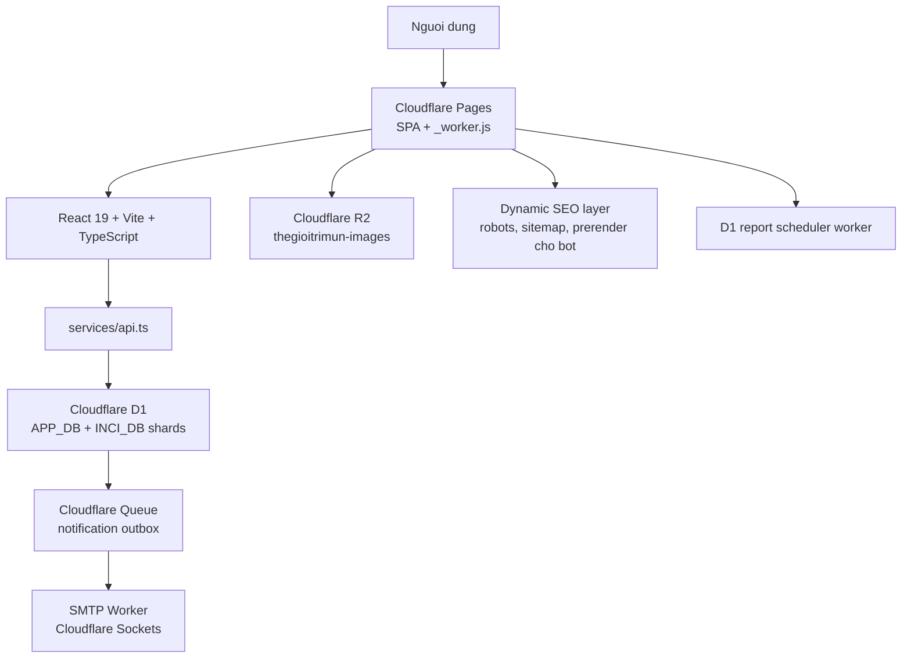

# Thế Giới Trị Mụn / thegioitrimun.vn

Tài liệu tích hợp Pancake POS: [`docs/PANCAKE_POS_INTEGRATION.md`](docs/PANCAKE_POS_INTEGRATION.md).

Tai lieu goc cho moc on dinh ngay 2026-03-22. README nay duoc viet lai de phan anh dung trang thai hien tai cua he thong va de co the dung nhu blueprint khi can rebuild toan bo website tren mot project moi.

- Live domain: [https://thegioitrimun.vn](https://thegioitrimun.vn)
- Cloudflare Pages project: `website-thegioitrimun`
- Cloudflare worker asset runtime: `iskin-clinic`
- Cloudflare scheduler worker: `natural-skin-admin-report-scheduler`
- APP_DB production: `thegioitrimun-app`
- INCI_DB production: `thegioitrimun-inci-shard-00`, `thegioitrimun-inci-shard-01`
- R2 bucket hien tai: `thegioitrimun-images`
- Stable snapshot branch: `codex/stable-blueprint-20260322`

## Muc tieu cua moc nay

Moc nay duoc xem la baseline on dinh de:
- van hanh production hang ngay
- rollback nhanh khi code moi gay loi
- tai tao lai frontend, D1 va Cloudflare tu dau
- kiem thu regression cho public site, auth, dashboard va SEO

## Tong quan kien truc



## Trang thai hien tai

He thong hien tai khong con la SPA tinh don thuan. No la mot lop phoi hop giua:
- frontend React tren Cloudflare Pages
- `_worker.js` xu ly SEO runtime, sitemap, robots, R2 proxy va bot prerender
- Cloudflare D1 cho auth/session, database va snapshot INCI
- Cloudflare Queue + SMTP cho email giao dich; email khong gui qua Resend
- Cloudflare R2 cho image delivery va image management
- fallback public data chi con de phuc vu du lieu noi bo/legacy, khong phai duong doc production

## Nhung thanh phan quan trong nhat

### 1. Frontend

- Entry: `index.tsx`
- Ung dung chinh: `App.tsx`
- Trang va widgets: `components/`
- Contexts: `contexts/`
- Hooks: `hooks/`
- Typings: `types.ts`
- I18n: `src/i18n.ts` va `src/locales/{vi,en,ru,cn}`

Frontend dang dung SPA routing tu quan ly trong `App.tsx`, khong dung React Router. URL duoc map qua state `View` va dong bo voi browser location.

### 2. Runtime worker tren Cloudflare

File quan trong: `_worker.js`

Worker dang dam nhan:
- `sitemap.xml` dong
- `robots.txt`
- prerender SEO cho bot va social crawler
- `X-Robots-Tag` theo tung route
- proxy doc anh R2 qua `/r2/<bucket>/<path>`
- upload/delete anh qua `/api/r2/upload` va `/api/r2/delete`
- fallback anh blog khi object khong ton tai
- fallback asset serving ve `env.ASSETS.fetch()` khi can

Day la lop rat quan trong. Neu deploy ma quen copy `_worker.js` vao `dist/`, production co the len HTML nhung mat SEO runtime, mat image proxy hoac mat sitemap dong.

### 3. Cloudflare D1 va email outbox

D1 la backend production cho:
- OAuth/session, nguoi dung va phan quyen
- san pham, INCI snapshot, don hang, dich vu, lich hen va dashboard
- noi dung public/admin va audit log

Email giao dich di theo luong:

```text
HTTP request -> D1 transaction -> notification_outbox (pending)
            -> cron dispatch -> Cloudflare Queue
            -> Worker queue consumer -> SMTP SSL port 465
            -> D1 status accepted/retrying/failed
```

Runtime production khong goi `api.resend.com`, Supabase Edge Function hay SMTP truc tiep tu frontend de gui email; moi email di qua D1 `notification_outbox` -> Cloudflare Queue -> SMTP consumer.

### 4. R2 image layer

Anh khong con phu thuoc hoan toan vao Supabase Storage. Production hien tai dung Cloudflare R2 qua bucket:
- `thegioitrimun-images`

Binding tren Cloudflare runtime:
- `R2_IMAGES`

Public base URL duoc worker xu ly tren:
- `/r2/...`
- `R2_PUBLIC_BASE_URL=https://thegioitrimun.vn/r2`

Trong app, cac bucket logic dang duoc xu ly nhu prefix ben trong R2:
- `site-assets`
- `avatars`
- `blog-images`
- `product-images`
- `assets`

### 5. Public fallback data

Trong cac script/duong legacy, app co fallback cho mot so read quan trong qua:
- `src/fallbackPublicData.ts`
- helper `withPublicReadFallback()` trong `services/api.ts`

Muc dich:
- homepage van len
- danh sach san pham/dich vu/bai viet van len
- mot so detail page quan trong van co noi dung fallback
- khong de user gap trang trang vi mot public endpoint treo

Luu y: production D1 khong dung fallback de tao du lieu gia va khong dung Supabase lam backend ghi.

## Repo inventory can nho

```text
App.tsx
_worker.js
components/
contexts/
hooks/
services/
src/
public/
scripts/
supabase/
workers/
.github/workflows/
```

### Thu muc can biet

- `services/api.ts`: service layer lon nhat, gom public reads, auth, admin mutations, checkout, dashboard
- `services/supabaseClient.d1.ts`: client disabled fail-closed, chi de tranh import legacy trong build D1
- `src/fallbackPublicData.ts`: snapshot public fallback
- `scripts/`: SEO batches, audits, QA, migration helpers, admin setup, image migration
- `supabase/migrations/`: toan bo lich su schema
- `supabase/functions/`: chi con cac function legacy khong phuc vu email production
- `workers/admin-report-scheduler/`: worker scheduler cho email report dinh ky
- `e2e/`: Playwright regression quan trong

## Supabase migrations hien co

Migration hien tai da bao gom cac cum thay doi chinh sau:
- translations cho content/blog/product
- product brands va galleries
- service slug
- hero responsive
- checkout, tax, discount, funnel tracking
- order lifecycle, payment, refund
- auth hardening va patient trigger restore
- review gate theo verified purchase
- dashboard metrics, drilldown, bulk order actions, report schedules
- phone cleanup va backfill patient data

Nguon migration:
- `supabase/migrations/20260301062136_add_about_translations.sql`
- ...
- `supabase/migrations/20260320211000_replace_placeholder_patient_phones.sql`

Khi rebuild tren project moi, khong duoc cherry-pick tung file le. Phai apply toan bo migration theo thu tu thoi gian.

## Edge functions legacy

Thu muc `supabase/functions/` khong con cac function email/bao cao Resend. Cac function GHTK va AI con lai la legacy migration reference, khong duoc goi trong build D1 production:
- `calculate-shipping-fee`
- `cancel-ghtk-order`
- `create-ghtk-order`
- `get-ghtk-pick-address-detail`
- `get-ghtk-pick-addresses`
- `ghtk-webhook`
- `print-ghtk-label`
- `track-ghtk-order`

## Cloudflare inventory hien co

### Pages / runtime

- Pages project: `website-thegioitrimun`
- Domain: `thegioitrimun.vn`
- Build artifact: `dist/`
- SPA asset fallback: bat trong `wrangler.jsonc`
- `_worker.js` duoc copy vao `dist/` trong `npm run build`

### R2

- Bucket: `thegioitrimun-images`
- Binding: `R2_IMAGES`
- Public route: `/r2/...`
- Images binding: `IMAGES` (bat buoc de decode va re-encode anh upload thanh WebP truoc khi luu R2)

### Scheduler worker

- Worker config: `wrangler.admin-report-scheduler.jsonc`
- Worker name: `natural-skin-admin-report-scheduler`
- Cron: `5 * * * *`
- Ghi report event vao D1 `notification_outbox`, sau do Queue/SMTP xu ly

## Bien moi truong can co

Khong commit secret that vao git. README nay chi ghi ten bien va vai tro.

### Frontend / Pages

| Bien | Bat buoc | Ghi chu |
| --- | --- | --- |
| `VITE_DATA_BACKEND` | Co | Dat `d1` trong moi build production |
| `VITE_R2_IMAGE_BASE_URL` | Khuyen nghi | Mac dinh dang la `/r2` |
| `VITE_IMAGE_STORAGE_PROVIDER` | Khuyen nghi | Dat `r2` tren production |

### Cloudflare Worker secrets

Khong khai bao cac bien nay voi tien to `VITE_` va khong dua vao frontend. Cau hinh bang `wrangler secret put`:

| Bien | Bat buoc | Ghi chu |
| --- | --- | --- |
| `GEMINI_API_KEY` | Co neu dung AI | Key chi duoc doc boi Worker `/api/ai/generate` |
| `SMTP_HOST` | Co | Host SMTP cua Worker email consumer |
| `SMTP_PORT` | Co | Dat `465` cho SMTP SSL |
| `SMTP_USERNAME` | Co | Tai khoan gui mail, chi luu trong Cloudflare Secret |
| `SMTP_PASSWORD` | Co | Mat khau SMTP, chi luu trong Cloudflare Secret |
| `SMTP_FROM_NAME` | Co | Ten hien thi cua nguoi gui |
| `SMTP_FROM_ADDRESS` | Co | Dia chi `From` cua email giao dich |
| `ADMIN_NOTIFICATION_EMAIL` | Khuyen nghi | Dia chi nhan thong bao noi bo |

Production D1 khong can `SUPABASE_*` hoac `INGREDIENT_SUPABASE_*` secrets. Neu cac bien nay con trong tai khoan Cloudflare, chung chi la secret legacy phuc vu migration/audit va khong duoc bind vao Worker D1.

File `.dev.vars.example` chi la mau placeholder cho local. File `.dev.vars` that phai nam ngoai git.

### Scripts / QA / admin setup

| Bien | Bat buoc | Ghi chu |
| --- | --- | --- |
| `SUPABASE_ACCESS_TOKEN` | Khong cho runtime | Chi dung khi chu dong chay script migration/audit nguon cu; khong can cho build, deploy hoac QA D1 |
| `E2E_ADMIN_EMAIL` | Co cho admin E2E | Tai khoan admin regression |
| `E2E_ADMIN_PASSWORD` | Co cho admin E2E | Mat khau tai khoan admin regression |
| `PLAYWRIGHT_BASE_URL` | Tuy chon | Mac dinh `https://thegioitrimun.vn` |

### Cloudflare / GitHub Actions

| Bien | Bat buoc | Ghi chu |
| --- | --- | --- |
| `CLOUDFLARE_API_TOKEN` | Co neu deploy CI | Token cho deploy preview/workflow |
| `CLOUDFLARE_ACCOUNT_ID` | Co neu deploy CI | Account ID Cloudflare |

## Cai dat local

### 1. Clone va install

```bash
git clone https://github.com/Hovidaiphuc/website-thegioitrimun.git
cd website-thegioitrimun
npm install
```

### 2. Tao `.env`

Chi tao cac bien can thiet, khong copy secret vao README.

### 3. Chay local

```bash
npm run dev
```

Luu y:
- `npm run dev` gio khoi dong ca worker local va Vite frontend.
- Worker local chay tai `http://127.0.0.1:8788`.
- Vite frontend chay tai `http://127.0.0.1:5173`.
- Cac route worker-backed `/api/*` va `/r2/*` duoc proxy sang worker local, khong con mac dinh ban vao production.
- Neu cong mac dinh dang ban, script se tu nhay sang cong trong tiep theo va in ro URL that trong terminal.

### 3.1 Cac lenh local dev huu ich

```bash
# Chay rieng frontend, mac dinh proxy sang worker local 127.0.0.1:8788
npm run dev:vite

# Chay rieng worker local
npm run dev:worker

# Chi dung khi co chu dich ro rang muon proxy thang sang production
npm run dev:prod-proxy
```

### 3.2 Doi cong local neu can

```bash
LOCAL_WORKER_PORT=8791 VITE_PORT=5174 npm run dev
```

Hoac neu chi muon doi proxy target cua frontend:

```bash
VITE_DEV_PROXY_TARGET=http://127.0.0.1:8791 npm run dev:vite
```

Luu y:
- Worker local van doc du lieu that tu D1 bindings va R2 theo config Wrangler. Cac script migration co the doc nguon Supabase chi khi duoc goi chu dong; day khong phai backend runtime.
- Neu worker local chua len, `npm run dev:vite` se khong tu fallback sang production nua. Day la chu dich de tranh debug nham tren moi truong live.

### 4. Build production local

```bash
npm run build
```

Build nay phai tao ra:
- `dist/index.html`
- `dist/assets/...`
- `dist/_worker.js`

Neu `dist/_worker.js` khong co, deploy se thieu runtime logic cua Cloudflare.

## Deploy production hien tai

### Deploy Pages

```bash
npm run deploy:pages
```

Script nay se:
1. build Vite + TypeScript
2. copy `_worker.js` vao `dist/`
3. direct upload `dist/` len Pages project `website-thegioitrimun`

### Deploy scheduler worker

```bash
npx wrangler deploy --config wrangler.admin-report-scheduler.jsonc
```

Chi can chay lenh nay khi thay doi worker report scheduler.

## Rebuild D1 tu dau tren mot project moi

Neu phai dung mot project moi de rebuild lai he thong, thu tu dung la:

### Buoc 1. Tao D1/R2/Queue

```bash
npm run d1:provision
npm run d1:migrate:remote
```

Tao `APP_DB`, cac shard `INCI_DB_*`, R2 private/public va Queue theo `wrangler.d1.production.jsonc`.

### Buoc 2. Tao Cloudflare Pages/Worker project moi neu can

- Tao Pages project
- Neu dung direct upload, chi can project name dung quy uoc team
- Bind R2 bucket `thegioitrimun-images` hoac bucket moi tuong duong vao `R2_IMAGES`
- Set bindings/secrets theo `wrangler.d1.production.jsonc`; khong dat Supabase env cho production
- Gan custom domain neu can

### Buoc 3. Deploy scheduler worker

Deploy `natural-skin-admin-report-scheduler`; worker chi dung binding D1 va Queue, khong goi Supabase.

### Buoc 4. Khoi tao admin regression user

```bash
E2E_ADMIN_EMAIL=... E2E_ADMIN_PASSWORD=... npm run e2e:admin-dashboard:setup
```

### Buoc 5. Chay regression gate

```bash
npm run lint
npm run build
PLAYWRIGHT_BASE_URL=https://your-domain npm run qa:site-critical:e2e
E2E_ADMIN_EMAIL=... E2E_ADMIN_PASSWORD=... PLAYWRIGHT_BASE_URL=https://your-domain npm run qa:admin-dashboard:e2e
```

Chi khi nhung buoc nay xanh thi moi xem nhu project moi da dat baseline hoat dong.

## Quy trinh QA can giu

### Static va build

```bash
npm run lint
npm run build
```

### Smoke va SEO

```bash
npm run qa:smoke
npm run qa:seo:ci
```

### Noi dung blog dai

```bash
npm run qa:d1
npm run qa:d1-email
```

Day la cac contract gate cho runtime D1 va luong email outbox. Cac audit blog legacy neu can doi chieu nguon cu phai chay rieng va khong duoc xem la duong production.

### Dashboard data

```bash
npm run qa:admin-d1
```

### Public critical E2E

```bash
PLAYWRIGHT_BASE_URL=https://thegioitrimun.vn npm run qa:site-critical:e2e
```

### Admin dashboard E2E

```bash
E2E_ADMIN_EMAIL=... E2E_ADMIN_PASSWORD=... PLAYWRIGHT_BASE_URL=https://thegioitrimun.vn npm run qa:admin-dashboard:e2e
```

## Ket qua xac minh o moc 2026-03-22

Nhung kiem tra da duoc chay tren live domain trong moc nay:
- `qa:blog-content` -> audited `209` bai dai, `0` findings
- `qa:site-critical:e2e` -> `4/4` passed
- `qa:admin-dashboard:e2e` -> passed
- Google OAuth callback/session checks -> Worker D1 tra ve dung session/cookie
- invalid login/session flow -> Worker D1 tra loi ngay, khong treo

Dieu nay co nghia moc nay phu hop de giu lam baseline stable.

## Cac script van hanh quan trong

| Script | Muc dich |
| --- | --- |
| `npm run deploy:pages` | Deploy production Pages |
| `npm run qa:site-regression` | Chay full regression public + admin + audits |
| `npm run qa:admin-regression` | Chay dashboard-focused regression |
| `npm run qa:blog-content` | Audit bai blog dai |
| `npm run qa:admin-dashboard` | Audit anomalies dashboard |
| `npm run e2e:admin-dashboard:setup` | Tao/repair admin E2E account |
| `npm run brands:seed-descriptions` | Seed mo ta brand |
| `npm run seo:translate-blog-backlog` | Dich backlog blog |
| `npm run seo:autofix-blog` | Batch SEO blog |
| `npm run seo:autofix-product` | Batch SEO product |
| `npm run seo:migrate-product-image-paths` | Chuan hoa image paths san pham |

## Luu y quan trong khi rollback hoac deploy

- `main` co the tiep tuc thay doi. Khong xem `main` la moc stable tuyet doi.
- Branch snapshot on dinh duoc tao rieng de lam diem quay lai.
- Direct upload cua Pages co the deploy tu dirty worktree. Vi vay can commit va push moc stable, khong chi rely vao lich su local.
- Public site co fallback data, nhung admin/auth/write operations khong co fallback tuong duong.
- Neu thay doi `_worker.js`, can kiem tra lai:
  - `sitemap.xml`
  - `robots.txt`
  - `/r2/...`
  - SEO cho bot
  - image fallback

## Gioi han hien tai

- Production auth, admin, commerce, INCI va email da dung D1/Worker; cac client/helper Supabase va migration script con lai chi de phuc vu doi soat/chuyen du lieu. Khong duoc goi chung tu D1 build.
- Dashboard audit hien tai van con theo doi anomaly pending order cu, can xu ly operational thay vi sua frontend.
- Mot so deployment truoc day tung la direct upload tu worktree dirty; branch snapshot duoc tao de giai quyet rui ro nay.

## Nhanh de tiep quan du an

Neu mot doi moi tiep quan du an, thu tu uu tien la:
1. Doc README nay tu dau den cuoi
2. Xac minh env vars va secrets
3. Xac minh Pages, D1 bindings, R2, Queue, SMTP secrets va scheduler worker
4. Chay regression gate
5. Chi sau do moi bat dau phat trien feature moi

## Branch baseline de giu moc nay

Branch duoc tao de dong bang moc on dinh hien tai:
- `codex/stable-blueprint-20260322`

Khi can mo mot du an moi dua tren nen tang nay, uu tien branch nay hoac commit goc cua branch nay lam diem bat dau, thay vi lay mot ban local khong ro trang thai.
