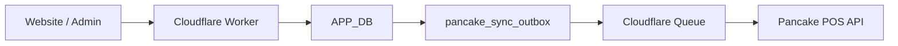

# Tích Hợp Pancake POS

## Phạm vi

Tích hợp này dùng Pancake POS Open API tại `https://pos.pages.fm/api/v1`. Website và Cloudflare D1 là nguồn dữ liệu chính. Luồng dữ liệu chỉ đi từ website sang Pancake:



Không có webhook Pancake cập nhật ngược sản phẩm, tồn kho, khách hàng hoặc đơn hàng vào website.

## Dữ liệu đồng bộ

| Tài nguyên | Nguồn chính | Đích Pancake | Quy tắc |
|---|---|---|---|
| Sản phẩm | `products`, `product_images` | Product + variation | SKU hoặc `WEB-{id}` là định danh ổn định |
| Tồn kho | `products.stock_quantity` | Variation warehouse | Cập nhật bằng endpoint `update_quantity` |
| Khách hàng | Snapshot trên đơn hàng | Customer | Khớp theo số điện thoại Việt Nam đã chuẩn hóa |
| Đơn hàng | `product_orders`, `product_order_items` | Order | `order_code` là `custom_id`, dò trước khi tạo để chống trùng |
| Thuế | Snapshot thuế của đơn | `order.tax` | `tax_amount + shipping_tax_amount` |

Pancake Open API không cung cấp endpoint quản lý bảng thuế. Chính sách thuế tiếp tục do website tính; Pancake chỉ nhận số thuế đã chốt trên từng đơn.

## Bảo mật

- `PANCAKE_API_KEY` chỉ tồn tại trong Cloudflare Worker Secret.
- Frontend không gọi trực tiếp `pos.pages.fm` và không nhận API key.
- Mọi endpoint `/api/admin/integrations/pancake/*` yêu cầu session admin.
- Endpoint ghi yêu cầu CSRF và tạo audit log.
- Log và API status chỉ trả về trạng thái `apiKeyConfigured`, không trả về secret.

## Cấu hình Cloudflare

Tạo Queue và DLQ cho từng môi trường:

```bash
npx wrangler queues create thegioitrimun-pancake-staging
npx wrangler queues create thegioitrimun-pancake-staging-dlq
npx wrangler queues create thegioitrimun-pancake
npx wrangler queues create thegioitrimun-pancake-dlq
```

Thiết lập secret:

```bash
npx wrangler secret put PANCAKE_API_KEY --config wrangler.d1.staging.jsonc
npx wrangler secret put PANCAKE_API_KEY --config wrangler.d1.production.jsonc
```

Thiết lập Worker vars sau trong config của từng môi trường:

```text
PANCAKE_ENABLED=true
PANCAKE_SHOP_ID=<shop-id>
PANCAKE_WAREHOUSE_ID=<warehouse-id>
PANCAKE_API_BASE_URL=https://pos.pages.fm/api/v1
PANCAKE_TIMEOUT_MS=12000
PANCAKE_MAX_ATTEMPTS=8
PANCAKE_DEFAULT_WEIGHT_GRAMS=100
```

Không bật `PANCAKE_ENABLED` trước khi test thành công shop và warehouse.

## API quản trị

| Method | Endpoint | Tác dụng |
|---|---|---|
| `GET` | `/api/admin/integrations/pancake/status` | Trạng thái cấu hình, outbox và link |
| `GET` | `/api/admin/integrations/pancake/outbox` | Danh sách công việc đồng bộ |
| `GET` | `/api/admin/integrations/pancake/warehouses` | Danh sách kho đã làm sạch secret |
| `POST` | `/api/admin/integrations/pancake/test` | Kiểm tra shop và warehouse |
| `POST` | `/api/admin/integrations/pancake/sync/products` | Xếp hàng đồng bộ sản phẩm |
| `POST` | `/api/admin/integrations/pancake/sync/customers` | Xếp hàng đồng bộ khách từ đơn hàng |
| `POST` | `/api/admin/integrations/pancake/sync/orders` | Xếp hàng đồng bộ đơn hàng |
| `POST` | `/api/admin/integrations/pancake/dispatch` | Đẩy bản ghi đang chờ vào Queue |
| `POST` | `/api/admin/integrations/pancake/retry` | Chạy lại bản ghi lỗi được chọn |

## Vận hành

1. Chạy migration D1 `0015_pancake_integration.sql`.
2. Tạo Queue, DLQ và binding `PANCAKE_QUEUE`.
3. Cấu hình secret/vars trên staging.
4. Gọi API `test`; xác nhận `configuredWarehouseFound=true`.
5. Đồng bộ một nhóm sản phẩm thử nghiệm.
6. Kiểm tra giá, ảnh, SKU và tồn kho trong Pancake.
7. Đồng bộ khách hàng và đơn thử nghiệm.
8. Chỉ sau đối chiếu mới xếp hàng toàn bộ sản phẩm.

Contract sản phẩm hiện ở version 3. Ngoài cập nhật tồn kho chuyên biệt, Worker kiểm tra các đường dẫn ảnh tương đối trong R2 trước khi gửi sang Pancake. Ảnh đã bị xóa hoặc còn trỏ tới đường dẫn legacy sẽ được bỏ qua, không làm cả sản phẩm retry/fail; ảnh hợp lệ vẫn được gửi bằng URL công khai đầy đủ.

Outbox tự retry lỗi mạng, timeout, HTTP 429 và lỗi 5xx theo backoff. Lỗi dữ liệu hoặc thiếu cấu hình bị chuyển `failed`/`blocked`. Lease bị treo được cron thu hồi. Tác vụ chạy nền nên cập nhật sản phẩm và checkout không chờ Pancake.

## Kiểm thử

```bash
npm run qa:pancake
npm run build
```

Nguồn contract: `api-1.json` do người dùng cung cấp và [Pancake POS Open API](https://docs.pancake.biz/pos/api/).
